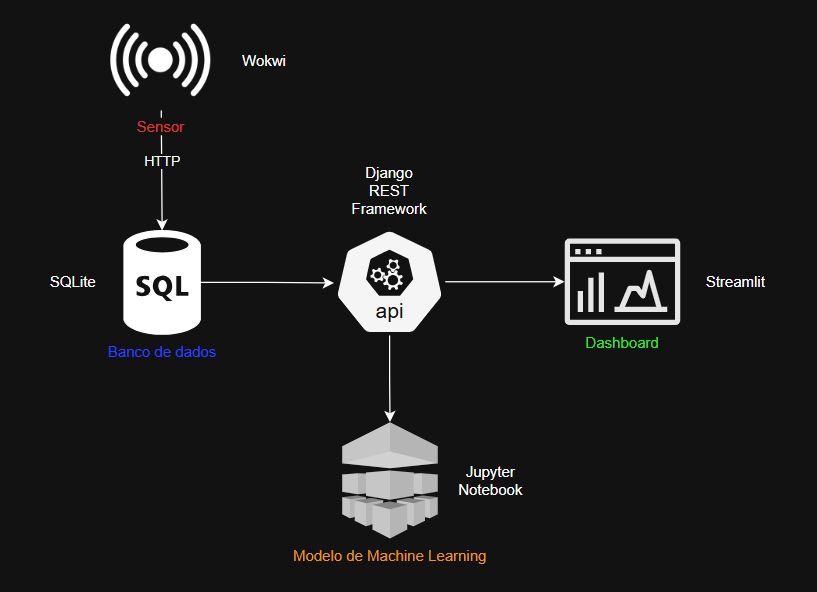

# Enterprise Challenge - Sprint 4 - Reply

<p align="center">
  <a href="https://www.fiap.com.br/">
    
  </a>
</p>

**Projeto final da disciplina de Inteligência Artificial, em parceria com a Hermes Reply.**

---

## 👨‍🎓 Integrantes

* **Antônio Ancelmo Neto Barros**
    * **RM:** rm563683
    * **GitHub:** [@AntonioBarros19](https://github.com/AntonioBarros19)
* **Beatriz Pilecarte de Melo**
    * **RM:** rm564952
    * **GitHub:** [@BPilecarte](https://github.com/BPilecarte)
* **Francismar Alves Martins Junior**
    * **RM:** rm562869
    * **GitHub:** [@yggdrasilGit](https://github.com/yggdrasilGit)
* **Matheus Soares Bento da Silva**
    * **RM:** rm565540
    * **GitHub:** [@matheusbento044](https://github.com/matheusbento04)
* **Vitor Eiji Fernandes Teruia**
    * **RM:** rm563683
    * **GitHub:** [@Vitor985-hub](https://github.com/Vitor985-hub)

## 👩‍🏫 Professores

* **Tutor:** Leonardo Ruiz Orabona
* **Coordenador:** André Godoi Chiovato

---

## 📜 Descrição do Projeto

Este projeto implementa um MVP (Minimum Viable Product) de um **pipeline de dados fim-a-fim**, simulando um cenário de monitoramento na Indústria 4.0. O fluxo consolida as etapas de arquitetura, coleta, armazenamento, modelagem e visualização de dados, demonstrando uma solução integrada e funcional.

O objetivo é transformar os dados brutos gerados por sensores em insights acionáveis, exibidos em um dashboard com métricas de desempenho e um sistema de alertas para detecção de anomalias, como picos de temperatura em um maquinário industrial.

---

## 🏛️ Arquitetura da Solução

A arquitetura do sistema foi desenhada para ser modular e escalável, representando o fluxo completo de dados desde a origem até a camada de apresentação.



*O arquivo editável do diagrama (`.drawio`) está disponível no diretório `/docs/arquitetura/`.*

---
## prints do sensor/monitor serial


---

## 📁 Estrutura do Repositório

O projeto está organizado na seguinte estrutura de pastas, conforme os requisitos da entrega:

```
.
├── assets/                     # Recursos estáticos
│   ├── logo-fiap.png
│   └── readme.md
│ 
├── dashboard/                  # Dashboards e visualizações
│   ├── data/
│       └── dataset_teste.csv
│   ├── .gitkeep                # Placeholder para manter pastas vazias
│   ├── app.py                  # Script principal em Python
│   └── readme.md
│
├── db/                         # Scripts e schemas de banco
│   └── reply_modelo_db/            # Estrutura de metadados e modelos de BD
│          ├── businessinfo/
│          ├── datatypes/
│          ├── domains/
│          ├── logical/             # Entidades, relações e subviews
│          ├── mapping/             # Mapeamentos e versões de entidades
│          ├── pm/                  # Process models
│          ├── rdbms/               # Configs de banco relacional
│          ├── rel/                 # Chaves estrangeiras e tabelas
│          ├── src
│          │── .gitignore           # Arquivos/pastas ignorados no Git
│          └── dl_settings.xml      # Configurações do Data Layer
│   │── .gitkeep                    # Placeholder para manter pastas vazias
│   └── reply_modelo_db.dmd         # Metadados do modelo de banco
│
├── docs/                       # Documentação técnica
│   │── arquitetura
│   │── screenshots
│   │── .gitkeep                    # Placeholder para manter pastas vazias
│   └── ingest.md
│
├── document/                   # Documentos adicionais
│   └── ...
│
├── fireguard_api/              # Projeto Django (API Backend)
│   ├── fireguard/               # Pasta de configuração principal do projeto Django
│       ├── __init__.py
│       ├── asgi.py              # Configuração para servidores ASGI (assíncronos)
│       ├── settings.py          # Configurações gerais do projeto
│       ├── urls.py              # Rotas de URL principais do projeto
│       └── wsgi.py              # Configuração para servidores WSGI (síncronos)
│   └── sensors/                # App Django para sensores
│       └── migrations/          # Arquivos de migração para o banco de dados
│           ├── __init__.py
│           └── 0001_initial.py  # Primeira migração (criação das tabelas)
│       ├── __init__.py
│       ├── admin.py             # Registro dos models no painel de admin do Django
│       ├── apps.py              # Configuração específica do app 'sensors'
│       ├── models.py            # Definição dos modelos de dados (tabelas do banco)
│       ├── serializers.py       # (DRF) Conversores de dados para o formato JSON
│       ├── tests.py             # Testes unitários para o app
│       ├── urls.py              # Rotas de URL específicas do app 'sensors'
│       └── views.py             # Lógica das requisições (onde ficam os endpoints da API)│
│   │── .gitkeep                 # Placeholder para manter pastas vazias
│   └── manage.py
│
│── fireguard-sensor/           # Projeto IoT (PlatformIO/Wokwi + ML)
│   │── src/                    # Código C++/Arduino do microcontrolador
│       └── prog1.ino
│   │── .gitignore                  # Arquivos/pastas ignorados no Git
│   │── diagram.json            # Diagrama de hardware (Wokwi)
│   │── platformio.ini          # Configuração PlatformIO
│   └── wokwi.toml              # Configuração simulação Wokwi
│
├── ingest/                 # Ingestão de dados de sensores
│   ├── config_mqtt/        # Configuração do MQTT
│   ├── ESP32/              # Scripts para ESP32
│   │── .gitkeep
│   ├── consumer.py         # Consumidor de mensagens MQTT
│   ├── plot_series.py      # Plotagem de séries temporais
│   ├── sample_data.csv     # Dados de amostra
│   ├── v1.json             # Configuração de versão
│   └── wokwi_monitor_serial.png # Monitor serial da simulação
│
├── ml/                     # Modelos de ML embarcados
│   ├── models_preditivo/
│          ├── modelo_falha_decision_tree.pkl
│          ├── modelo_falha_knn.pkl
│           └── scaler_falha.pkl
│   │── .gitkeep
│   ├── dataset_tratado.csv
│   └── modelo_preditivo.ipynb
│
└── src/                    # Código adicional
│   └── readme.md
│
│── .gitignore
│
│── README.md
│
│── requirements.txt
│
└── teste.cpp
```

---

## 🔧 Ferramentas e Tecnologias

* **Simulação do Sensor:** Wokwi com ESP32
* **Banco de Dados:** SQLite
* **Machine Learning:** Python com Scikit-learn, Pandas e Matplotlib
* **Dashboard:** Streamlit
* **Versionamento:** Git e GitHub

---

# Machine Learning 🤖
 
### Problema escolhido
 
Em ambientes industriais, o monitoramento da temperatura é um fator crítico para garantir a segurança operacional, a qualidade do produto e a preservação dos equipamentos. Pequenas variações podem indicar falhas em sistemas de refrigeração, superaquecimento de motores, desgaste de componentes ou até riscos de incêndio. O modelo  foi treinado para prever falhas nas máquinas e auxiliar na manutenção preditiva.

---

## 🖼️ Imagem do Modelo do Banco de Dados
 
### Modelo Lógico
 
 
### Modelo Relacional
 
---

## 🚀 Como Executar o Pipeline Completo

Siga os passos abaixo para configurar e executar o projeto em um ambiente local.

**Pré-requisitos:**
* Python 3.8+
* Git
* [Listar outros, como o SGBD que vocês usaram]

**1. Clone o Repositório:**
```bash
git clone [https://github.com/seu-usuario/seu-repositorio.git](https://github.com/seu-usuario/seu-repositorio.git)
cd seu-repositorio
```

**2. Simulação e Coleta de Dados:**
A fonte de dados é um sensor de temperatura DHT22 simulado em um ESP32 no Wokwi. As instruções detalhadas estão no [README da Ingestão](/ingest/esp32/README.md). Os dados brutos gerados para este projeto estão disponíveis em `/ingest/sample_data.csv`.

**3. Configuração do Banco de Dados:**
Primeiro, execute o script para criar as tabelas no seu banco de dados.
```bash
# Exemplo de comando para executar o script SQL
psql -U seu_usuario -d seu_banco < db/schema.sql
```
Em seguida, execute o script Python para carregar os dados do arquivo CSV para o banco.
```bash
# Pode ser necessário instalar dependências antes
pip install -r requirements.txt 
python db/carga_dados.py
```

**4. Treinamento do Modelo de Machine Learning:**
O modelo de ML é treinado e avaliado em um Jupyter Notebook. Abra e execute todas as células do arquivo `/ml/treinamento_modelo.ipynb` para treinar o modelo com os dados do banco.

**5. Visualização no Dashboard:**
Para iniciar o dashboard interativo, execute a aplicação Streamlit:
```bash
cd dashboard
pip install -r requirements.txt
streamlit run app.py
```
Acesse o endereço local informado no terminal para visualizar os KPIs e o sistema de alertas.

## Gráfico da série temporal do sensor

Para gerar o gráfico estático da série temporal (linhas bruta, média móvel e threshold):

```
python ingest/plot_timeseries.py
```
o resultado sera salvo em:
[grafico timeseries](docs\screenshots\sensor_timeseries.png)

---

## 🎬 Vídeo Demonstrativo

Uma demonstração completa do pipeline em funcionamento, desde a geração de dados até o alerta no dashboard, está disponível no link abaixo:

**[➡️ Link para o seu vídeo de até 5 minutos no YouTube (não listado) aqui]**

---

## 📋 Licença

Este projeto está licenciado sob a Licença de Atribuição 4.0 International Creative Commons. Veja a `LICENSE` para mais detalhes.
